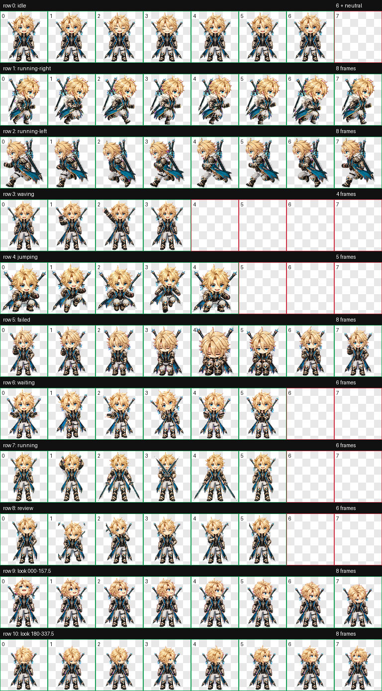

# 法尔伽 Codex 桌宠

非商业同人桌宠：Q 版法尔伽，西风骑士团大团长，背负两把「狼的武功歌」。



## 包含内容

- `varka/pet.json`：Codex 桌宠配置。
- `varka/spritesheet.webp`：已打包的 v2 精灵图集。
- 9 组标准状态：待机、左右移动、挥手、跳跃、失败、等待、工作、复核。
- 16 个屏幕朝向；包含双剑互动动作。

## 安装

1. 下载本仓库的 ZIP，或使用 `git clone`。
2. 在仓库根目录打开 PowerShell。
3. 运行以下命令，将 `varka` 安装到 Codex 的自定义桌宠目录：

```powershell
$source = Join-Path (Get-Location) 'varka'
$target = Join-Path $env:USERPROFILE '.codex\pets\varka'

New-Item -ItemType Directory -Force -Path $target | Out-Null
Copy-Item "$source\*" $target -Recurse -Force
```

如果本机已有同名 `varka` 桌宠，请先自行备份 `C:\Users\<你的用户名>\.codex\pets\varka`；上述命令会覆盖其中的 `pet.json` 和 `spritesheet.webp`。安装后重启 Codex，或在桌宠列表中重新切换一次。

## 技术信息

- 格式：WebP（RGBA）
- 图集：`1536 × 2288`，`8 × 11` 格
- `spriteVersionNumber`：`2`
- 已完成结构校验：图集尺寸、透明背景、行列数与 v2 配置均通过。

已知小瑕疵：指针朝向循环的 `337.5° → 000°` 过渡存在轻微中心/缩放跳动；不影响标准互动动作。

## 仓库结构

```text
.
├── assets/
│   └── varka-preview.png     # README 预览
├── varka/
│   ├── pet.json              # 安装配置
│   └── spritesheet.webp      # 桌宠图集
└── NOTICE.md                 # 同人资产说明
```

生成过程文件、分镜和原始参考素材未纳入版本控制，避免仓库膨胀并减少重复分发。

## 同人说明

本项目为非商业同人创作，与 HoYoverse 无关联、未获其认可或赞助。`Genshin Impact`、法尔伽及相关角色、武器设计的权利归 HoYoverse 所有；详见 [NOTICE.md](NOTICE.md)。
